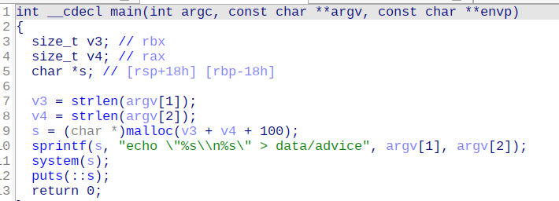

- ```pyt
  @app.route('/contact', methods = ['GET', 'POST'])
  def contact():
  	if request.method == 'GET':
  		return render_template('contact.html')
  	elif request.method == 'POST':
  		try:
  			output = check_output(['./bin/advice', request.form['name'], request.form['advice']], stderr=STDOUT)
  		except:
  			output = 'Something wrong!'
  		return render_template('contact.html', output=output.decode())
  ```

- Xem qua `backend` thì thấy chức năng `/contact` có thực thi một binary `advice` với 2 argument tương ứng lấy từ `web` là `username` và `advice`.

- Ta sẽ thực hiện decompiler `advice` để xem nó làm gì.

- 

- Nhìn có thể thấy ngay lỗi `cmd injection` nên mình sẽ thực hiện `reverse shell`, tuy nhiên với `id` user thì mình không thể đọc được flag bằng `cat`. Sau một lúc tìm tòi thì mình thấy `as` tương tự với `cat` có thể đọc được `flag` tại `/root/root.txt`.