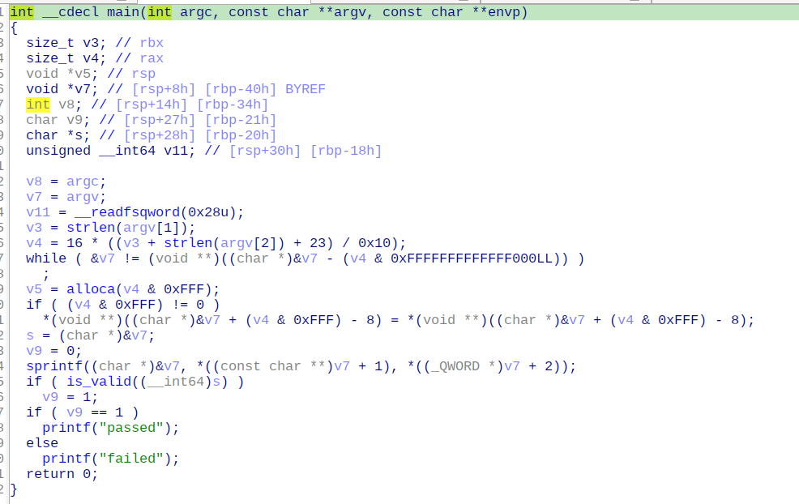

- Đây là bản vá và sẽ không còn `cmd injection` tại `advice`, nhưng tính năng `/admin` sẽ giúp ta thực hiện lấy `flag`.

- ```py
  @app.route('/admin', methods = ['GET', 'POST'])
  def admin():
  	if request.method == 'GET':
  		return render_template('admin.html')
  	elif request.method == 'POST':
  		try:
  			output = check_output(['./bin/admin', request.form['username'], request.form['password']], stderr=STDOUT)
  			if output==b'passed':
  				output = open('/admin.flag', 'rb').read()
  			else:
  				output = b'Username or password is incorrect!'
  		except Exception as e:
  			output = b'Username or password is incorrect!'
  		return render_template('admin.html', output=output.decode())
  ```

- Chức năng này thực thi `admin` với 2 argument `username` và `password`, rồi lấy `output` từ `admin` để check xem `login` thành công hay không.

- 

- Ta có thể thấy ngay bug `format string` tại `sprintf` do đó ta có thể `overflow` từ `v7` xuống `v9` trả về `passed` và `login` thành công.

- Bài này mk chạy mỗi bin với payload của mình thì được nhưng lúc dựng web lên thì có vẻ nó dài hơn và làm lỗi do ghi đè giá trị trong `s` khiến hàm `is_valid` segment fault nên bị xịt bài này.