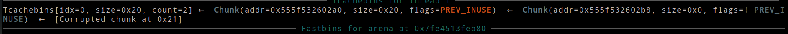
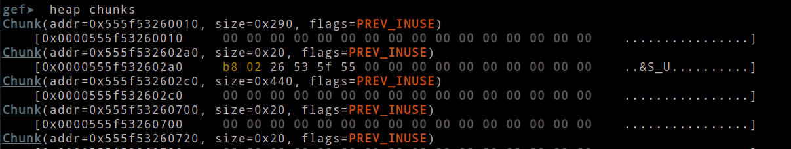

### Ý tưởng
- challenge cho ta 3 file gồm `binary`, `libc` và `ld`, ta sẽ dùng ida để `decompiler` xem chương trình hoạt động như nào

- 

- Chương trình có 3 `option`: `create`, `delete` và `math`. Dường như nó là một chương trình khá đơn giản, mọi dữ liệu được thao tác trên `heap` và nó không có một hàm in dữ liệu nào do đó ta không thể leak bất cứ thứ gì.

- 

- 

- Hàm `delete` sau khi `free` thì lại không xóa con trỏ do đó có thể gây ra lỗi `UAF`

- Ở hàm `create` không có gì nổi bật khi ta chỉ tạo được `heap` nhưng không ghi được gì vào.

- Tuy nhiên ở  hàm math lại có một thứ mà ta có thể khai thác

- 

- Các `chunk` sẽ được `add` các giá trị tương ứng với `buf`, `v3`, `v4`. Do là `add` nên ta có thể `control` giá trị của `fd pointer` khi nó đã `free`, với phiên bản `libc-2.31` thì cơ chế `xor` chưa xuất hiện nên bên trong `fd pointer` là một địa chỉ được `free` trước đó. Ta có thể lợi dụng hàm này để có thể trỏ đến một vị trí tùy ý trên `heap` cũng như thay đổi `fd pointer + 8` để `double free`.

- Mục tiêu của ta sẽ là đưa 1 `chunk` vào `unsorted bin` chuyển `libc` vào `fd pointer` để ta có thể tùy ý trỏ tùy ý trên phân vùng `libc`. Tiếp đến ta sẽ trỏ đến `environ` của `libc` để có được `stack` và thực hiện ghi đè 2 `saverip` của `math` và `main`.

### Exploit

​	- Đầu tiên ta sẽ tạo một lượng lớn `heap` để `overlap` các `chunk`

- ```python 
  for i in range(40):
      choice(1)
  ```

- ```python
  double_free(0)
  choice(3, 0, p64(0x18))
  choice(1)
  choice(1)
  choice(3, 41, p64(0x420))
  
  choice(2, 1)
  ```

- Sau đó ta `double free` 1 `chunk` và khiến `fd pointer` của nó trỏ đến `size` của `chunk` kế tiếp, mục đích là để thay đổi `size` của `chunk` kế tiếp thành `0x440` để đưa `chunk` này vào `unsorted bin` 

- 

- 

- 

- Dựa theo cơ chế của `libc-2.31` thì số `chunk` được `malloc` trong `tcache` phụ thuộc vào `count` hay là số lần `free`, vậy nên để `malloc` vào `libc` và `stack` ta cần 4 lần `malloc` với `chunk` ngoài cùng sẽ là `chunk` đệm để ta control `fd pointer`: `control->heap->libc->stack`.

- ```python
  choice(2, 3)
  choice(2, 4)
  choice(2, 0)
  choice(2, 5)
  
  choice(3, 5, p64(0x20))
  choice(3, 1, p64(0x2a20))
  ```

- sau khi `free` 4 chunk ta sẽ khiến `chunk heap` tăng `0x20` để nó trỏ vào `libc` của `unsorted bin` rồi thay đổi giá trị `libc` này thành `libc-environ` để nó trỏ vào `stack`

- 

- sau khi có `stack` ta sẽ đưa 3 `chunk` ra ngoài lúc này chỉ còn mỗi `stack` trong `tcache`.

- ```python
  for i in range(3):
      choice(1)
  ```

- 

- ta để lại `stack` là để `free` 1 `chunk heap` vào lúc này `tcache` có dạng `heap->stack` và ta có thể trỏ đến `stack` tùy ý.

- ```python
  choice(2, 7)
  choice(3, 7, p64(-256, sign=True))
  choice(1)
  choice(1)
  choice(3, 46, p64(0xbfa7e))
  ```

- bây giờ ta sẽ trỏ đến `saverip` của `main` và ghi đè thành `one_gadget` với `offset` là `0xbfa7e`

- 

- 

- do `main` là một `loop` vô tận nên ta không thể `ret` tự nhiên được, đồng thời điều kiện thực thi `one_gadget` thiếu `rdx` do nó khác `0` nên ta sẽ thay đổi `saverip math` để nó set `rdx = 0` và `leave ; ret`

- ta thấy được 1 đoạn của `create` sẽ giải quyết 2 điều này, do lúc `ret` của `math` `rax = 0`

- 

- lặp lại các bước trên để đưa tiếp tục control `stack`

- ```python
  choice(2, 10)
  choice(2, 6)
  choice(2, 11)
  choice(3, 7, p64(-0x20, sign=True))
  
  choice(3, 11, p64(0x20))
  for i in range(3):
      choice(1)
  ```

- Ta sẽ thay đổi `saverip math` thành `create+60`

- 

- 

-  