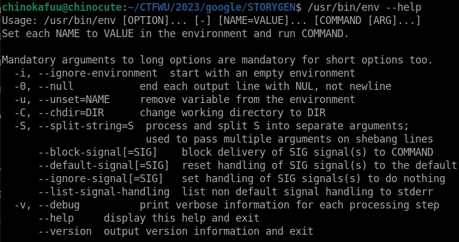
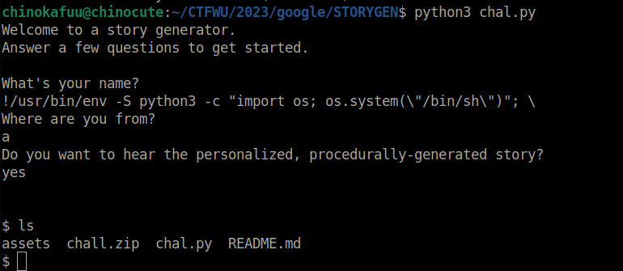

- Một challenge liên quan tới bash, ban đầu mình cứ nghĩ nó là `bash injection`, tuy nhiên nguồn gốc của lỗi liên quan đến `shebang` khi nó trỏ tới file `/usr/bin/env` thì có thể thực thi được mã tùy ý
- `/usr/bin/env` là một file chứa các môi trường dòng lệnh:
- 
- Với option `-S` nó sẽ tìm kiếm mỗi trường PATH ở đây mình sẽ chọn python3,  sau đó nó sẽ thực hiện python3 tuy nhiên ta có thể chèn thêm `-c` của python để thực hiện `command` của python
- Để loại bỏ vế sau ta sài `\`, payload cụ thể `!/usr/bin/env -S python3 -c "import os; os.system(\"/bin/sh\")"; \`
- 