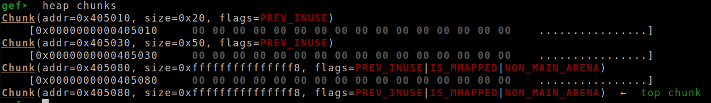
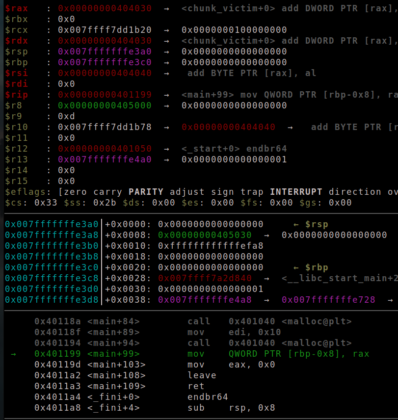

### Giới thiệu

 - Kỹ thuật `house of force` là kỹ thuật khiến malloc trả về một con trỏ tùy ý. Kỹ thuật này đòi hỏi phải thay đổi được `top chunk`, thường thì đưa `top chunk` thành `-1` để đạt giá trị lớn nhất

- Sau đó malloc với 1 size tương ứng thì ta sẽ được một chunk tùy ý

- công thức tính size là: `size = addr_chunk - addr_top_chunk - 16 - 8` trong đó `addr_chunk` là địa chỉ trả về mong muốn,  `addr_top_chunk` là địa chỉ bắt đầu của topchunk, 16 là 2 phân vùng của `size` và `prev_size` còn 8 là `buffer` của chunk

### Demo trên libc-2.23

 - đầu tiên ta malloc 1 chunk và thay đổi size của `top_chunk` thành -1, thêm 1 biến global đây là mục tiêu trả về của malloc

 - ```c
   uint64_t chunk_victim = 1; 
   
   int main() {
       malloc(0x10);
       uint64_t *ptr = malloc(0x40);
       ptr[0x50/8 - 1] = -1;
       ............................
   ```

 - 

 - ```c
   uint64_t size = (uint64_t)(&chunk_victim) - (uint64_t)(&ptr[8]) - 3*sizeof(uint64_t);
   malloc(size);
   uint64_t *newchunk = malloc(0x10);
   ```

 - với lần malloc đầu tiên `top_chunk` sẽ được thay đổi thành `chunk_victim` lần malloc sau ta sẽ lấy được địa chỉ của `chunk_victim`

	- 