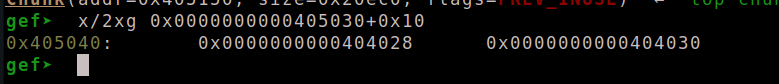
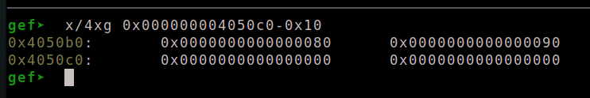
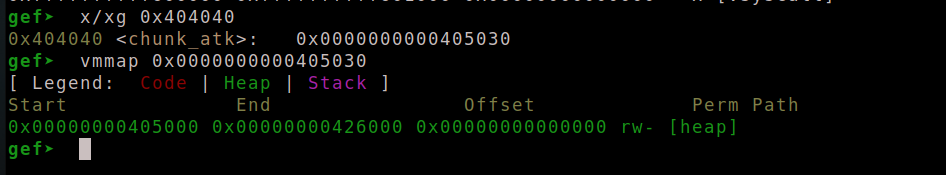
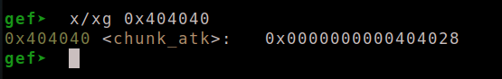

#### I. Overlapping
**1. Giới thiệu**
  - Overlapping là một kỹ thuật khá giống với việc gộp chunk bằng việc gộp các chunk phía dưới để trở thành 1 chunk lơn hơn tuy nhiên nó không làm ảnh hưởng đến chunk bên dưới, do đó có thể sử dụng cả 2 chunk.
  - Vì chunk trên có thể ghi xuống chunk dưới nên sẽ gây ra lỗi heap overflow.
  - Để thực hiện được kỹ thuật này ta cần điều khiển được chunk header.

**2. Cách thức**
  - Do malloc không kiểm tra tính đúng sai của size do đó khi thay đổi được size ta có thể áp dụng được kỹ thuật này.
  - Ta sẽ tạo ra 2 chunk với kích thước lần lượt là 0x40 và 0x20

| addr   | value   | value   |
| ------ | ------- | ------- |
| 000000 | 0x00000 | 0x00041 |
| 000010 | 0x00000 | 0x00000 |
| xxxxxx | xxxxxxx | xxxxxxx |
| 000040 | 0x00000 | 0x00021 |
| 000050 | 0x00000 | 0x00000 |
| xxxxxx | xxxxxxx | xxxxxxx |

| addr   | value   | value   |
| ------ | ------- | ------- |
| 000000 | 0x00000 | 0x00061 |
| 000010 | 0x00000 | 0x00000 |
| xxxxxx | xxxxxxx | xxxxxxx |
| 000040 | 0x00000 | 0x00021 |
| 000050 | 0x00000 | 0x00000 |
| xxxxxx | xxxxxxx | xxxxxxx |
  - ta sẽ thực hiện chồng chéo 2 chunk bằng cách thay đổi size của chunk phía trên thành 0x61, lúc này chunk ban đầu sẽ là 2 khối chunk ban đầu, tuy nhiên chunk thứ 2 vẫn còn đó và ta vẫn có thể sử dụng nó
### II. Unsafe Unlink
**1. Giới thiệu
  - Đây là một kỹ thuật khiến fd_nextsize trỏ vào chunk đó thông qua việc thực hiện hàm unlink. ( đại loại là vậy =)) )
  - Việc này sẽ dẫn tới ghi đề các giá trị trong chunk đó, với kỹ thuật này thường sẽ tấn công vào nơi lưu con trỏ heap (thường là bss) khiến nó trỏ vào vùng phía trên của nó.

**2. Cách thức**

 - ```c
   long long int* chunk_atk;
   
   int main() {
       malloc(0x10);
       chunk_atk = malloc(0x80);
       int *ptr = malloc(0x80);
       .........................
   ```

  - thực hiện malloc 2 chunk trong đó 1 chunk được lưu tại bss, mục tiêu sẽ là tấn công vào vùng bss này

  - Để thực thi được unlink ta cần pass qua 1 số cái

  - ```c
    if (__builtin_expect (FD->bk != P || BK->fd != P, 0))		     
        malloc_printerr (check_action, "corrupted double-linked list", P);  
      ......................................................................
      if (!prev_inuse(p)) {
    	    prevsize = prev_size (p);
    	    size += prevsize;
    	    p = chunk_at_offset(p, -((long) prevsize));
    	    unlink(av, p, bck, fwd);
    	  } 
    ```
    
  - để thoải mãn 1 trong 2 điều kiên này `(FD->bk != P || BK->fd != P)`ta sẽ setup fake chunk nhu sau

  - 

  - tại đây ta cần đưa prev_inuse của chunk cần free về 0 và prev_size của no thành 0x80 để free tưởng fake chunk của ta bắt đầu từ `chunk_atk[2]`

  - 

  - sau đó chúng ta sẽ thực hiện giải phóng `ptr` do `ptr` không có `prev_inuse` nên `unlink` sẽ được gọi

  - trước khi free:

  - 

  - sau khi free:

  - 

  - bây giờ `chunk_atk` đã trỏ đến `chunk_atk-0x18`, đây chính là mục tiêu của ta.

### III. Gộp chunk unsorted bin

- Với các chunk có kích thước lớn thì sẽ được giải phòng vào ub và trong ub có 1 cơ chế là gộp các chunk đã được free lân cận để tiết kiệm và tối ưu bộ nhớ

- Khi gộp chunk chúng sẽ kiểm tra `prev_inuse` của chunk đó, nếu là 1 sẽ gộp dưới và nếu là 0 sẽ gộp trên.

- Khi gộp 1 chunk fake với 1 chunk real ta cần setup chunk fake để free hiêu rằng chunk fake đã được free

- với fakechunk trên thì ta chỉ cần setup size, `prev_size(nextchunk)` đồng thời đưa `prev_inuse(nextchunk)` về 0. Ta set thêm `fd` và `bk` pass qua `unlink`

- ```c
  fakechunk[-1] = 0xd1;
  fakechunk[0] = &fakechunk[-1];
  fakechunk[1] = &fakechunk[0];
  fakechunk[2] = &fakechunk[-2];
  nextchunk[-1] = 0x90;
  nextchunk[-2] = 0xd0;
  ```

- với fakechunk dưới thì cần set size cho fakechunk, ta cũng có thể điều chỉnh size của chunk real sao cho chunk real kề với chunk fake, và ta sẽ set `prev_size(nextchunk(fakechunk))` đồng thời đưa `prev_inuse(nextchunk(fakechunk))` về 0. Ở fakechunk set thêm `fd` và `bk` pass qua `unlink`

- ```c
  fakechunk = &ptr2[4];
  ptr2[3] = 0x201;
  ptr1[-1] = 0x131;
  ptr2[0x200/8 + 2] = 0x200;
  ptr2[0x200/8 + 3] = 0x80;
  fakechunk[0] = &fakechunk[-1];
  fakechunk[1] = &fakechunk[0];
  fakechunk[2] = &fakechunk[-2];
  ```